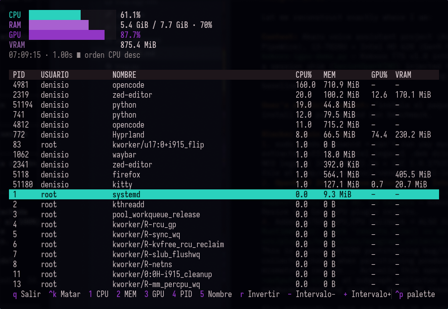

# triop

**htop meets nvtop** — a single terminal UI showing live CPU, RAM *and* GPU usage,
both system-wide and **per process**, sortable by any column.

There was no single terminal tool on Linux that showed all three metrics per
process. `htop` lacks GPU, `nvtop` lacks CPU/RAM. triop fills the gap.

<p align="center">
  
</p>

## Features

- **Live totals**: CPU %, RAM used/total, GPU busy %, VRAM in use — with htop-style bars.
- **Per-process table**: PID, user, name, CPU %, RSS, GPU %, VRAM.
- **Sorting**: by CPU, MEM, GPU, PID or name (`1`–`5`), reversed with `r`.
- **Kill processes**: `Ctrl+K` sends SIGTERM to the selected process (with safety guards).
- **Non-interactive mode**: `triop --print [N]` prints one table and exits — script friendly.
- **Adjustable refresh rate** from 250 ms upward (`-` / `+`).
- **Transparent background** (uses your terminal's real background, SGR default) and
  automatic [pywal](https://github.com/dylanaraps/pywal) palette detection.
- **Zero privileged access**: everything is read from `/proc`. No GPU driver SDKs.

GPU metrics work out of the box on **Intel (i915/xe)** and **AMD (amdgpu)** using the
kernel's DRM fdinfo — the same mechanism nvtop uses. Processes not touching the GPU
show `–`.

## Install

Requirements: Linux, Python ≥ 3.13.

With [`uv`](https://docs.astral.sh/uv/) (recommended):

```bash
git clone https://github.com/denisio04/triop.git && cd triop
uv tool install .
```

Or classic venv:

```bash
git clone https://github.com/denisio04/triop.git && cd triop
uv venv && uv pip install . ~/.local/bin  # see note below
ln -sf "$PWD/.venv/bin/triop" ~/.local/bin/triop
```

Or without installing:

```bash
uv run --with-editable . python triop.py
```

## Usage

```bash
triop                      # interactive TUI (1 s refresh)
triop --sort gpu           # start sorted by GPU usage
triop --interval 0.5       # faster polling (min 0.25)
triop --print 10           # print top-10 table once and exit
triop --version
```

### Keys

| Key | Action |
|---|---|
| `q` / `Ctrl+C` | Quit |
| `Ctrl+K` | Kill selected process (SIGTERM) |
| `1`–`5` | Sort by CPU / MEM / GPU / PID / Name |
| `r` | Reverse sort order |
| `j` `k` `↑` `↓` `PgUp` `PgDn` | Navigate |
| `-` / `+` | Refresh interval −/+ (min 250 ms) |

## How it works

Every tick, triop reads `/proc` exactly once:

- **CPU total**: deltas of `/proc/stat` (`100 × (1 − Δidle/Δtotal)`).
- **CPU per process**: `utime+stime` deltas from `/proc/<pid>/stat`, scaled by `CLK_TCK`.
- **RAM**: `/proc/meminfo` (`MemTotal − MemAvailable`) and `statm` resident pages.
- **GPU per process**: sums `drm-engine-*` ns deltas across all
  `/proc/<pid>/fdinfo/<fd>` files; VRAM from `drm-total-*` KiB keys.
  GPU% = `min(100, Σ Δengine_ns / Δt)` — clamped when engines run in parallel.
- Only recently-active GPU processes are re-sampled every tick; idle ones are
  re-checked every 10 cycles.

## Limitations

- GPU usage of **other users'** processes is hidden by the kernel unless you run `sudo triop`
  (CPU/RAM of all users are always visible).
- Two processes sharing a GPU buffer count it twice in VRAM totals (v1 accepts this bias).
- Multi-engine GPU load (render + video at once) is clamped to 100 % in the column;
  the per-process engine breakdown arrives in a future release.
- **NVIDIA** GPUs are not supported yet (planned via NVML).

## Roadmap

- [x] Kill process (`Ctrl+K`)
- [ ] Filter by name (`/`), TOML config file, CSV snapshot export
- [ ] Automatic AMD/NVIDIA support (NVML), GPU power via RAPL
- [ ] Per-metric history sparklines
- [ ] AUR package

## License

[MIT](LICENSE)
